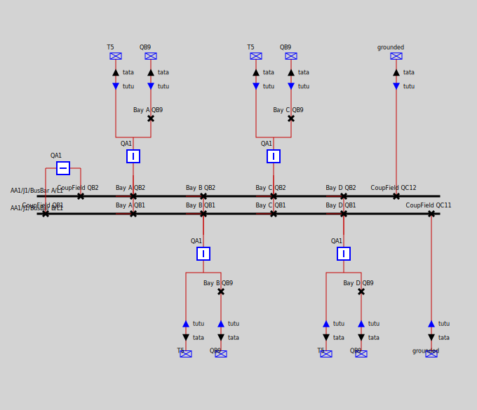

# compasSLDExample

Quick and dirty PoC on rendering a substation described in a scd. The algorithm used is the full automatic placement (PostionByClustering)

Results are found here [./results](results).
Output Files are json and svg.

One is with the stack option = false

the other with the stack option = true

Todo:
- Done: parsing to create a corresponding graph.
- Done: add new kinds of component - that are beyond the one that are use for operation
- Done: there are disconnectors that do have only one connecting node. We will need to add fictitious feederNode to display the outgoing connected element (line / TR /....), but ideally, having - the information would be better.
- Done: there are connections to the ground. For this PoC, this will be a kind of feeder... but this is something that you may want to improve.
- todo: there are also informations regarding x,y position, that could be used for the semi-automatic algorithm. I will propose both approaches.
- Done: render!
- Todo: then we will have to handle more complex structures: the one proposed in the sample is simple... but let's keep that for a next step.
